# Production database clone: Almaz to Kvant

This runbook creates an encrypted, snapshot-consistent clone of Almaz's Clustr
database on Kvant. It does not stop PostgreSQL, pause the crawler, alter source
rows, or overwrite an existing clone. Export execution and cleanup are explicit
production actions; `--preflight` is read-only.

## Data flow

```mermaid
flowchart LR
  P["Almaz PostgreSQL 17"] -->|"exported read-only snapshot"| D["custom pg_dump"]
  D --> V["pg_restore list validation"]
  V --> E["GPG encryption with Kvant public key"]
  E --> C["SHA-256 manifest"]
  C -->|"resumable rsync over SSH"| K["Kvant incoming archive"]
  K --> R["new digest-pinned PostgreSQL clone"]
  R --> Q["count and schema identity verification"]
  Q --> W["calculation and publication rehearsal"]
```



## One-time Kvant setup

1. Copy the repository to its intended immutable checkout on Kvant.
2. Create a service-user-owned key directory. This key is unattended and
   encryption-only;
   protect and back it up separately from the exports:

   ```bash
   sudo install -d -m 0755 /etc/clustr
   sudo install -d -m 0700 -o onnwee -g onnwee /etc/clustr/clone-gpg
   sudo -u onnwee /opt/clustr/scripts/clone/init-encryption.sh \
     /etc/clustr/clone-gpg
   ```

3. Copy [clustr-clone.env.example](../../deploy/clone/clustr-clone.env.example)
   to `/etc/clustr/clustr-clone.env`, set the printed full fingerprint, and use
   mode `0640`. The file contains no database password or private key.
4. Verify `ssh -o BatchMode=yes almaz true`. Almaz's PostgreSQL remains private;
   the source helper executes through SSH and uses credentials already scoped to
   the database container.

## Read-only preflight

```bash
/opt/clustr/scripts/clone/export-to-kvant.sh \
  /etc/clustr/clustr-clone.env --preflight
```

Require all of these before export approval:

- exact source host, container, database, PostgreSQL 17 version, and byte size;
- at least 1.25 times the database size free in Almaz's export parent;
- at least 2.5 times the database size free in Kvant's clone parent;
- the configured Kvant port is reserved for the new clone;
- no old export is holding a snapshot transaction.

Preflight must not create the source or destination roots.

## Execute and monitor

Run from Kvant after explicit production-export approval:

```bash
clone_id="clustr-$(date -u +%Y%m%dT%H%M%SZ)-$(openssl rand -hex 4)"
/opt/clustr/scripts/clone/export-to-kvant.sh \
  /etc/clustr/clustr-clone.env --execute "$clone_id" \
  2>&1 | tee "/var/tmp/${clone_id}.log"
```

The source Module permits only one export. During `pg_dump`, monitor Almaz's
free space, PostgreSQL transaction age, load, and container health. Abort if it
threatens production. An abort keeps production unchanged, removes any plaintext
partial archive, and marks the export `FAILED`.

Success requires:

- source `READY`, valid checksums, and an encrypted `.dump.gpg` only;
- Kvant `READY`, no retained plaintext dump, loopback-only PostgreSQL listener,
  and container restart policy `no`;
- `verification.json` status `verified` with exact source/clone counts for
  subreddits, users, posts, and comments plus matching migration, encoding,
  collation, and extensions;
- the manifest's image is pinned by digest;
- the source production API/crawler remain healthy.

## Resume and failure recovery

An interrupted export itself is restarted under a new clone identity. An
interrupted transfer is resumable because the immutable source export remains:

```bash
/opt/clustr/scripts/clone/export-to-kvant.sh \
  /etc/clustr/clustr-clone.env --resume "$clone_id"
```

Restore is intentionally not resumed inside a partly populated database. Inspect
the `FAILED` marker and logs, remove that exact failed clone with confirmation,
then run `--resume`; it reuses the checksum-verified encrypted export and creates
a clean destination.

```bash
/opt/clustr/scripts/clone/remove-clone.sh \
  /mnt/data2/clustr-clones "$clone_id" "--confirm-${clone_id}"
```

## Handoff to calculation

Read the clone's `READY` file for its loopback port and use its private password
file to construct `DATABASE_URL` without printing it. Apply migrations to the
clone, run the full catalog/revision calculation, and retain calculation evidence
under the clone identity. Never point production readers at the clone.

## Retention and explicit cleanup

Keep the encrypted source and incoming exports until clone verification and the
calculation rehearsal both succeed. Keep the latest verified clone through the
Almaz cutover rollback window. Then remove artifacts independently:

```bash
/opt/clustr/scripts/clone/export-to-kvant.sh \
  /etc/clustr/clustr-clone.env --cleanup-source "$clone_id" "--confirm-${clone_id}"

/opt/clustr/scripts/clone/remove-incoming-export.sh \
  /mnt/data2/clustr-exports "$clone_id" "--confirm-${clone_id}"

/opt/clustr/scripts/clone/remove-clone.sh \
  /mnt/data2/clustr-clones "$clone_id" "--confirm-${clone_id}"
```

There is no automatic retention deletion. This is deliberate: clone identities
are release evidence and cleanup should happen only after the operator verifies
which revision and backup window they support.

## Security and recovery notes

- SSH encrypts transport; GPG encrypts the archive at rest on both hosts.
- Only Kvant stores the private key. Almaz receives an ephemeral public keyring.
- Database passwords never enter the export manifest, command line, or transfer.
- Clone PostgreSQL binds only to `127.0.0.1` and uses a generated clone-only
  credential.
- SHA-256 and GPG's protected ciphertext detect corruption; only Kvant's private
  key can decrypt the recipient-bound archive.
- This logical clone excludes cluster roles/ACLs and is not a substitute for the
  independent production backup required before Almaz migration or cutover.
